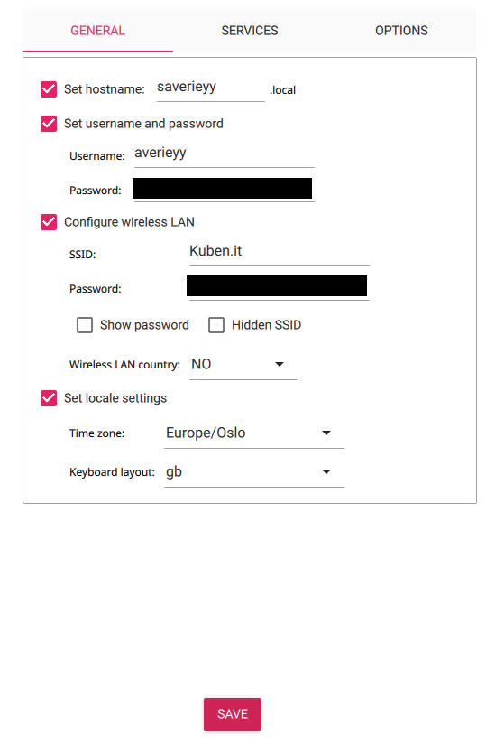
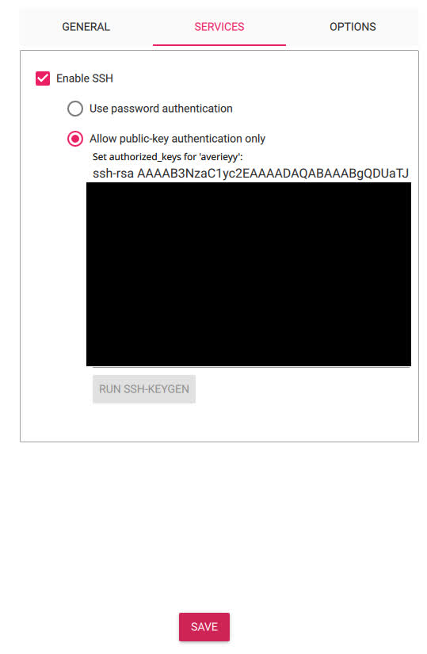

# Telephone catalog

## Setup

### Host machine

Assuming the server is a Raspberry Pi 4 Model B.

Download the [Raspberry Pi imager](https://www.raspberrypi.com/software/) software. This can also be done by installing it from your package manager (if you are using linux)

|arch|debian|fedora|
|-|-|-|
|```sudo pacman -Syu rpi-imager```|```sudo apt install rpi-imager```|```sudo dnf in rpi-imager```|

Download Ubuntu Server LTS (currently version 24) (64-bit) onto the Raspberry Pi's SD card using the Raspberry Pi imager. Remember to create a user and set up an internet connection in the installer by clicking the **Edit settings** button. You should also add a public key, so you can connect to the Raspberry Pi over ssh.

This is my configuration:





<br>
When you are booted into the system, install git by running

```sh
sudo apt install git
```

### This program

Clone this repository.

```sh
git clone https://github.com/averieyy/telephonecat.git
cd telephonecat
```

#### setup.sh

Run the setup script by running

```sh
sh ./setup.sh
```

The script does the following:

- Update installed packages (```sudo apt update && sudo apt upgrade```)
- Install the dependencies the phone catalog needs (postgres, python, git)
- Adds a user, "phoneboy"
  - The default password is "phoneboy". You can change this later by running
    
    ```sh
    sudo passwd phoneboy
    ```
    You should also change the password in postgres.
    ```sh
    sudo -u postgres psql
    ```
    ```sql
    ALTER USER phoneboy password '<new password>';
    ```
- Sets up the postgres database
  - Creates a database "telephone"
  - Grants all priviliges on said database to phoneboy
- Clones the repository in /home/phoneboy.
- Creates the table "people" in the database.

## Running the program

Assuming the program was set up correctly, you can run the following in the terminal to run it.

```sh
sudo su phoneboy
cd ~/telephonecat
python3 main.py
```

## General advice

This guide does not go over some important parts of setting up a server.

The following tips can be important for setting up a server.

<details>
<summary>SSH server</summary>
<br>

To set up an ssh (secure shell) server, you first need the ```openssh``` package.

```sh
sudo apt install openssh
```

Then, we need to start the server. In some cases, this has alreay been done at installation, but if not, run
```sh
sudo systemctl start sshd.service  # Start the server
sudo systemctl enable sshd.service # Set the server to autostart on boot
```

By default, The ssh server allows people to authenticate through username+password, but this leaves the server exposed to brute force attacks. A safer way to authenticate is through public key authentication.

On your PC, run ```ssh-keygen``` to create a new key. Remember its location for later.

Before you can copy the key over, you need to know the IP address of the server. you can do this by running 
```ip a```

You should now copy the __public__ key over to the server. __NEVER SHARE YOUR PRIVATE KEY__,

### Linux

To copy the key, run

```sh
ssh-copy-id -i <the key file location> <user>@<ip address>
```

</details>